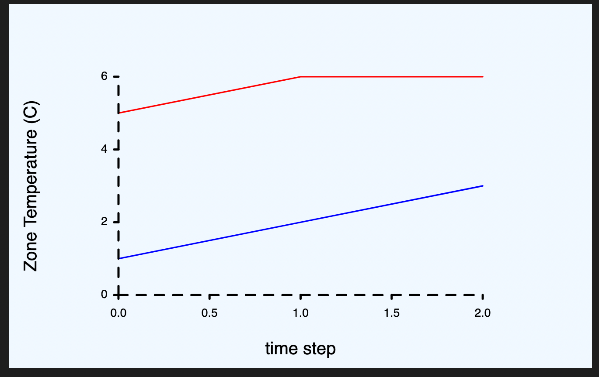

# A Rust Validation library


[](https://codecov.io/gh/SIMPLE-BuildingSimulation/validate)


This crate was developed with the intent of helping you to validate scientific
tools; for exmple, for comparing the results of the temperature calculated
by an algorithm and those measured in an experiment. It is supposed to be embedded
the unit or integration testing.

Different Validation tasks can be created by implementing the [`Validate`] trait.  
These tasks will be stored into a [`Validations`] object which will write a report 
into a Markdown File.

[CHECK THE DOCS](https://simple-buildingsimulation.github.io/validate/validate/index.html)

# Example 1: Built-in Time Series validator

Validate has a built-in time series validator that plots two time series and calculates—if required—the 
Root Mean Squared Error (RSME) and Mean Bias Error (MBE) between them. Setting a maximum RMSE or MBE
is optional and it will make it return an error if these values are exceded

```rs
use validate::{Validations, SeriesValidator};

let expected = vec![1., 2., 3.];
let found = vec![5., 6., 6.];

let mut validator = Validations::new("report.md", ".");    
// Note that we are not defining a maximum allowed error
let v = validate::SeriesValidator {
    x_label: Some("time step"),
    y_label: Some("Zone Temperature"),
    y_units: Some("C"),
    title: "Compare Series!",
    expected,
    found,
    ..validate::SeriesValidator::default()
};
validator.push(Box::new(v));

// This will not fail because we did not set a maximum allowed 
// Root Mean Square Error or Mean Bias Error... if we did, it would return 
// an error and the unwrap woul
validator.validate().unwrap();
```
This produces a result as follows

## Compare Series!

 * Root Mean Squared Error: 3.70
 * Mean Bias Error: -3.67

> **ERROR (todo, really)**: There should be an SVG plot here, but Github's markdown insists in writng the raw HTML instead of showing it. It looks allright on my preview in VSCode. This is the PNG screenshot of that




# Example 2: Write custom validator

```rs
use validate::{Validations, Validate};
use std::{fs::File, io::Write};

// This checks that two numbers are equal
struct CustomValidation {
    expected: u8,
    found: u8,
    title: &'static str,
}

impl Validate for CustomValidation {
    fn validate(&self, file: &mut File)->Result<(),String>{
        let valid = self.expected == self.found;
        
        
        // We return an error if the validation is not succesful, but we still
        // write something into the report. Even if this particular Validation 
        // fails, the Validations object will run all the validations and print
        // the error messages into the STDERR
        let (ret, buf) = if valid {
            let ret = Ok(());
            let buf = format!("# {}\n\n * Passed! {} and {} are equal", self.title, self.expected, self.found);
            (ret, buf)
        }else{
            let ret = Err(format!("{} and {} aren't equal", self.expected, self.found));
            let buf = format!("# {}\n\n * Failed... {} and {} aren't equal", self.title, self.expected, self.found );
            (ret, buf)
        };
        file.write_all(buf.as_bytes()).unwrap();
        ret
    }
}

let v = CustomValidation{
    expected: 2,
    found: 2,
    title: "Check that 2 and 3 are equal"
};
let mut validations = Validations::new("report.md", ".");
validations.push(Box::new(v));
validations.validate().unwrap()

```
